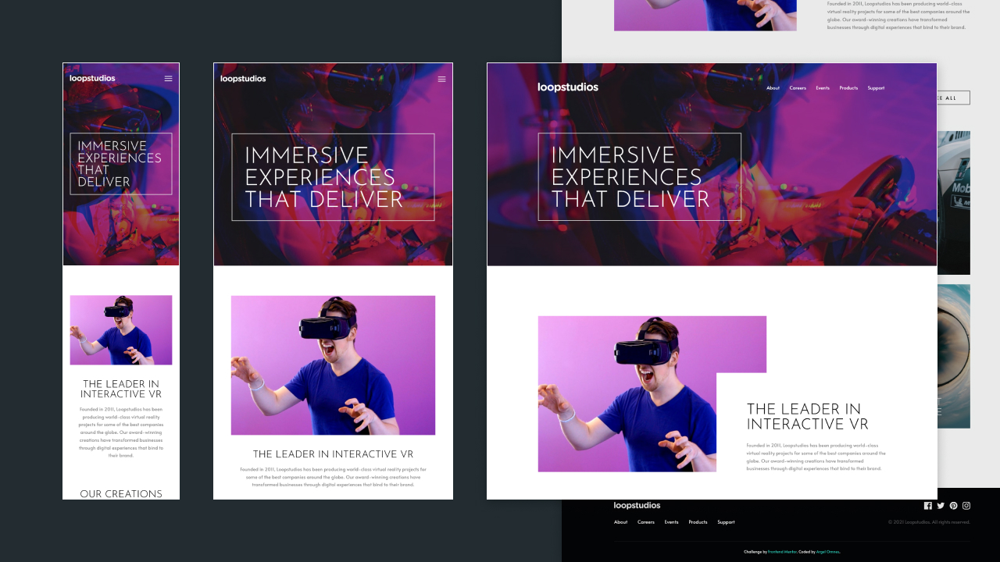

# Frontend Mentor - Loopstudios landing page solution

This is a solution to the [Loopstudios landing page challenge on Frontend Mentor](https://www.frontendmentor.io/challenges/loopstudios-landing-page-N88J5Onjw). Frontend Mentor challenges help you improve your coding skills by building realistic projects.

## Table of contents

-   [Overview](#overview)
    -   [The challenge](#the-challenge)
    -   [Screenshot](#screenshot)
    -   [Links](#links)
-   [My process](#my-process)
    -   [Built with](#built-with)
    -   [What I learned](#what-i-learned)
    -   [Continued development](#continued-development)
    -   [Useful resources](#useful-resources)
-   [Author](#author)
-   [Acknowledgments](#acknowledgments)

## Overview

### The challenge

Users should be able to:

-   View the optimal layout for the site depending on their device's screen size
-   See hover states for all interactive elements on the page

### Screenshot



### Links

-   [Solution](https://www.frontendmentor.io/solutions/loopstudios-landing-page-using-tailwind-css-jit-I14V5a5yH)
-   [Live Site](https://loopstudios-ao.netlify.app/)

## My process

### Built with

-   Semantic HTML5 markup
-   CSS custom properties
-   Flexbox
-   CSS Grid
-   Mobile-first workflow
-   [Tailwind CSS](https://tailwindcss.com/)

### What I learned

You can do inline calculations using Tailwind CSS' JIT. It will then output a class and you can reuse it. The sample below is what did out of curiosity. But deleted when I refactored my code.

```html
<div class="left-[calc(6vw-0.5rem)]">sample</div>
```

```css
.left-\[calc\(6vw-0\.5rem\)\] {
    left: calc(6vw - 0.5rem);
}
```

There's also a proper way to use custom fonts in Tailwind. The advantage is you'll have the cross-browser font stack that it provides as fallback.

```javascript
// tailwind.config.js

// 01 grab what we'll need
const defaultTheme = require('tailwindcss/defaultTheme');

module.exports = {
    theme: {
        fontFamily: {
            // 02 define your custom font followed by Tw's font stack
            headline: ['"Josefin Sans"', ...defaultTheme.fontFamily.sans],
            sans: ['Alata', ...defaultTheme.fontFamily.sans],
        },
    },
};
```

This video by Simon of Tailwind Labs helped a lot: https://youtu.be/sOnBG2wUm1s

Documentation: https://tailwindcss.com/docs/font-family#customizing

### Continued development

I've only used CSS for the mobile menus of the past challenges that I did. Using JS feels like a more straightforward approach. Maybe I'll stick with this. Also, I tried to rely on classes generated by Tailwind as much as possible instead of writing them to get more familiar with what's available/possible. It's a slow process especially when I know the values but had to look up the class names first. Good news is Tailwind IntelliSense is now working even with jit mode on.

### Useful resources

-   [Space Between](https://tailwindcss.com/docs/space) - Really handy. I don't need to add margin for each element. Simply apply it to the parent element and boom!
-   The following extensions are also helpful:
    -   VS Code: [Tailwind CSS IntelliSense](https://marketplace.visualstudio.com/items?itemName=bradlc.vscode-tailwindcss) and [Headwind](https://marketplace.visualstudio.com/items?itemName=heybourn.headwind).
    -   Sublime Text: [Tailwind CSS Autocomplete](https://packagecontrol.io/packages/Tailwind%20CSS%20Autocomplete)

## Author

-   Website - [argelomnes](https://argelomnes.com/)
-   Frontend Mentor - [@argelomnes](https://www.frontendmentor.io/profile/argelomnes)
-   Twitter - [@argelomnes](https://www.twitter.com/argelomnes)
